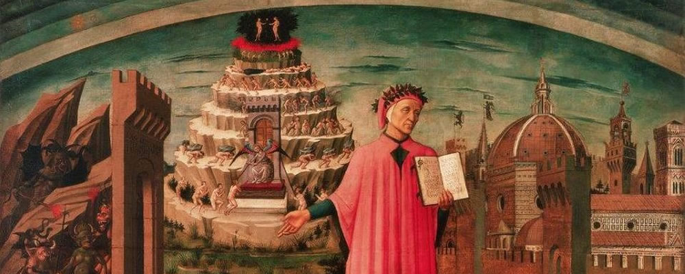

# **PERFIDIA - Game Design Document** - SK

V tomto repozitári sa nachádza implementácia projektu pre predmet **Objektové Technológie** – hra **Perfidia**. Cieľom hry je zostúpiť dole cez kruhy pekla, vyhýbajúc sa nepriateľom, pekelnej skaze, plameňom, pasciam a nebezpečným výškam, aby sa hráč mohol dostať z pekla cez jediný existujúci východ – portál na poslednom, deviatom kruhu, nazývanom **Perfidia**, ktorý sa stal inšpiráciou pre názov hry.

**Autor**: Mykhailo M. Dudash

**Vybraná téma**: Dark and light

----------

## **1. Úvod**

Vytvorená ako záverečný projekt pre predmet **Objektové Technológie**, hra spĺňa kritériá témy **"Dark and Light"**, interpretovanej v kontexte pekla a mytológie.

V nasledujúcej časti budú opísané: inšpirácie a použité nástroje 

### **1.1 Inšpirácia**
**La Divina Commedia**

  
   
  <em>La Divina Commedia</em>

V prvom rade bola inšpiráciou pre myšlienku, prostredie a samotnú hru vízia pekla z epickej básne **Dante Alighieriho – *La Divina Commedia***. V nej sa peklo opisuje ako rozdelené do 9 kruhov, usporiadaných jeden pod druhým, pričom čím ťažší bol hriech, tým hlbšie sa duša v posmrtnom svete ocitla.

Kruhy pekla, ktoré sú v hre zobrazené, predstavujú pôvodné kruhy pod ich latinskými názvami:

-   **Limbus** – žiaľ neosvietených a nepokrstených duší.
-   **Libidines** – večná nepokojnosť tých, ktorí túžia po telesných rozkošiach.
-   **Gula** – trest za nadmerné pôžitkárstvo a nenásytnosť.
-   **Aviditas** – utrpenie chamtivých a posadnutých bohatstvom.
-   **Ira** – nekonečný hnev a potláčaná zloba.
-   **Haeresis** – muky za odpadlíctvo a falošné učenia.
-   **Violentia** – odplata za krutosť a spôsobené utrpenie.
-   **Fraus** – trest za podlosť, prefíkanosť a podvod.
-   ***Perfidia*** – záhuba zradcov, odpadlíkov a klamárov.

  
   
  <em>Dante's Inferno</em>

### **1.2 Herný zážitok**

Cieľom hry je prežiť na každej úrovni pekla, postupne sa prebojovať smerom nadol cez portály na konci každého kruhu.
Hráč sa musí postaviť skazeným dušiam pekla, ktoré na neho útočia, vyhnúť sa plameňom pekelného ohňa a hlavne sa poponáhľať – pretože ak sa ako čistá smrteľná duša zdrží v kruhu pekla príliš dlho, začne hromadiť skazu, ktorá ho nakoniec premení na jednu z porazených a stratených duší.

### **1.3 Vývojový softvér**

-   **Pygame-CE** -  zvolený programovací jazyk
-   **Visual Studio Code** -  vybrané IDE
-   **Tiled** - grafický nástroj na vytváranie levelov
-   **Itch.io** -  zdroj grafických assetov a zvukov do hry
- **Adobe Photoshop** - na grafickú úpravu assetov, ukazovateľov (barov) a zmenu farebných schém.

___
## **2. Koncept**

### **2.1 Prehľad hry**

Hráč má **tri hlavné úlohy**:

1.  **Dostať sa od začiatku úrovne až k portálu** na jej konci a skočiť doň.
2.  **Nezomrieť** v dôsledku útokov nepriateľov a poškodenia ohňom.
3.  **Nenahromadiť maximálnu úroveň skazy**.

Nepriatelia a plamene pekelného ohňa sú pevne rozmiestnené na určitých miestach mapy. Skaza (porucha) rastie o konkrétnu hodnotu každú sekundu, čím hráča neustále tlačí k postupu nadol.

Hráč môže zabiť nepriateľa, aby sa vyhol jeho útoku, ale pred ohňom a skazou sa nedá uniknúť – s nimi bude musieť vždy počítať a prispôsobovať im svoju stratégiu.

### **2.2 Interpretácia témy: Dark and light**

**Dark and Light** – hra o súboji svetla a tmy.

Svetlo v hre predstavuje duša hráča, nespravodlivo uvrhnutá do pekla a hľadajúca z neho únik. Tma sú nepriatelia – duše kedysi živých hriešnikov, ktoré pohltila pekelná skaza, a samotné prostredie, ktoré je nepriateľské, spôsobuje hráčovi ujmu a nechce ho zo svojej moci pustiť.

V tomto koncepte hráč vzdoruje samotnej podstate pekla – tak, ako svetlo vzdoruje tme.

### **2.3 Základné mechaniky**
-   **Pasce** – ak do nich hráč spadne, bez možnosti záchrany zhorí v pekelnom plameni.
-   **Skaza** – neustále sa hromadí každú sekundu počas úrovne. Ak dosiahne svoje maximum, hráč zomrie.
-   **Určené miesta pre generovanie nepriateľov** – fixné body na mape, nastavené v Tiled, na ktorých sa nepriatelia jednorazovo spawnujú.
-   **Nepriatelia** – keď sa hráč priblíži, začnú na neho útočiť a prenasledovať ho.
-   **Oheň** – spôsobuje periodické poškodenie hráčovi, ak sa dostane do jeho dosahu.
### **2.4 Návrh tried**

-   **Game** – hlavná riadiaca trieda hry, ktorá spravuje prechody medzi úrovňami, ich obnovovanie, zobrazenie úvodnej obrazovky, prechodových obrazoviek a cutscény, prehráva hudbu na pozadí podľa aktuálnej úrovne.
-   **Level** – trieda pre každú úroveň, ktorá umiestňuje tiles, nepriateľov, oheň a hráča. Načítava paralaxné pozadie a aktualizuje ho, zároveň sa stará o optimalizované načítanie nepriateľov.
-   **Player** – trieda hráča, ktorá určuje jeho parametre, zvuky, frames, monitoruje vstupy hráča a riadi fyziku postavy.
-   **Cutscene** – trieda pre zobrazenie finálnej cutscény po dosiahnutí posledného kruhu pekla. Definuje jej prvky, animácie, texty a ďalšie aspekty.
-   **StartScreen** – trieda pre animované zobrazenie úvodného menu, ktorá čaká na stlačenie **Enter** na začiatok hry.
-   **HellScreen** – prechodová obrazovka pri prechode na ďalší level, zobrazujúca názov a číslo kruhu pekla pred začiatkom interakcie.
-   **Fire** – trieda zodpovedná za oheň, jeho zónu poškodenia, animáciu a aktualizáciu.
-   **Enemy** – trieda nepriateľov, ktorá opisuje ich pohybovú a útočnú logiku, animácie, aktualizáciu a odstránenie zo hry po ich porážke.
-   **CorruptionBar** – trieda pre ukazovateľ skazy, ktorý vizuálne znázorňuje aktuálnu úroveň nahromadenej skazy.
-   **HealthBar** – trieda pre ukazovateľ zdravia, ktorý zobrazuje aktuálny stav života hráča.

___
## **3. Grafika**

### **3.1 Sprites interaktívnych prvkov**

  
  
  
  
   
  <em>Hráč a nepriatelia</em>

  
  
  
   
  <em>Typy ohňov</em>

Z **itch.io** boli vybrané vhodné assety pre postavy a objekty.

-   **Hráčov sprite** – bojovník, ktorý dokonale zapadá do tematiky hry.
-   **Nepriatelia** -  majú tri typy spriteov: mužský, ženský a prevrátený (znetvorený).
-   **Sprite ohňa** - pôvodne existoval iba v dvoch variantoch – oranžový a jasne modrý. Sprite čierneho ohňa bol vytvorený v **Adobe Photoshop**, aby lepšie zapadol do sivých úrovní hry.

### **3.2 Dizajn herného sveta**
Pre všetkých osem herných úrovní (deviaty slúži ako cutscéna) bol vytvorený unikátny dizajn, inšpirovaný fantáziou a kontextom hriechov popísaných pre jednotlivé kruhy pekla.

Kruhy boli rozdelené do štyroch farebných paliet, vždy po dvoch úrovniach:

-   **Sivé**
-   **Tmavožlté**
-   **Krvavočervené**
-   **Tmavomodré**

Ako hlavný asset pre prostredie bol použitý platený balík:  
🔗 [Pixel Art Hell Tiles & Enemies Asset Pack (32x32)](https://gandalfhardcore.itch.io/pixel-art-hell-tiles-enemies-asset-pack-32x32).

Tento pôvodne obsahoval iba alú tematiku pekla. Aby hra získala väčšiu rozmanitosť a vizuálnu atraktivitu, **Adobe Photoshop** bol použitý na transformáciu farieb pomocou zmeny Hue a kontrastu, čím boli vytvorené ďalšie tri farebné palety.

Snímky zo všetkých úrovní sú uvedené nižšie:

  
   
  <em>Limbus</em>

  
   
  <em>Libidines</em>

  
   
  <em>Gula</em>

  
   
  <em>Aviditas</em>

  
   
  <em>Ira</em>

  
   
  <em>Haeresis</em>

  
   
  <em>Violentia</em>

  
   
  <em>Fraus</em>

___
## **4. Audio**

### **4.1 Hudba**
Hudba pre hru bola vybraná tak, aby plne zodpovedala atmosfére hry – ponurá, temná, miestami pripomínajúca hororové melódie.

Zdrojom hudby pre úrovne, úvodnú obrazovku, prechodové obrazovky, cutscénu a obrazovku Game Over bol zvukový balík:  
🔗 [Audio Asset Collection](https://nihil-existentia.itch.io/free-audio-asset-collection).

Výber hudby bol rozdelený podľa typov úrovní, aby každá úroveň mala svoju vlastnú atmosféru podporenú zodpovedajúcim hudobným sprievodom.

### **4.1 Zvuky**
Na ozvučenie zvukových efektov – meče, kroky, pády, útoky a ďalšie akcie – boli použité zvuky z RPG SFX balíka:  
🔗 [Fantasy 200 SFX Pack](https://tommusic.itch.io/free-fantasy-200-sfx-pack).

Pre väčšiu rozmanitosť má každá akcia viacero rôznych zvukov, ktoré sa prehrávajú s náhodnou pravdepodobnosťou, čím sa zabezpečuje príjemnejší a prirodzenejší herný zážitok**

## **5. Herný zážitok**

### **5.1 Používateľské rozhranie**

Používateľské rozhranie pozostáva z animovaného hlavného menu, z ktorého môže hráč stlačením klávesy Enter začať hru. Na debugging a iné potrebné účely bolo pridané okamžité prepínanie medzi úrovňami pomocou klávesu TAB

V samotnej hre sú použité dva ukazovatele (bary):

-   **Health Bar** – zobrazuje aktuálnu úroveň zdravia hráča.
-   **Corruption Bar** – vizuálne indikátor skazy (poruchy), ktorý ukazuje jej aktuálnu nahromadenú hodnotu.

Tieto prvky umožňujú hráčovi jednoducho sledovať svoj stav počas hry.

### **5.2 Ovládanie**

#### **Klávesnica:**

-   **A** – pohyb doľava
-   **D** – pohyb doprava
-   **SPACE** – skok
-   **SHIFT** – sprint
-   **TAB** – okamžitý prechod medzi úrovňami (debugovanie, demonštrácia...)

#### **Myš:**

-   **Ľavé tlačidlo myši (LMB)** – útok hráča

___
Mykhailo M. Dudash
